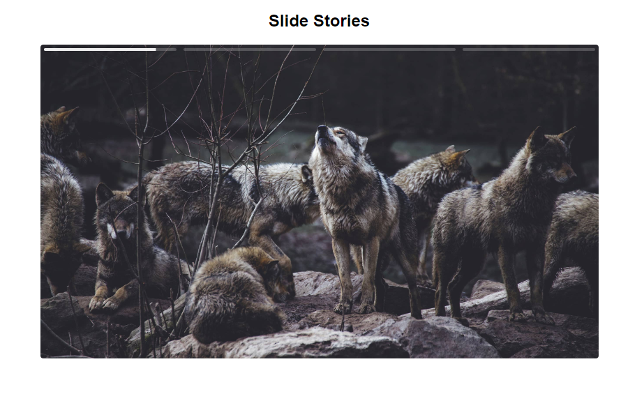

# TypeScript Prática DOM



Um projeto em TypeScript que cria um slide semelhante aos stories do Instagram, permitindo pausar, voltar e avançar os slides.

[Acesse o site](https://rochamaatheus.github.io/TypeScript-Pratica-DOM/dist/index.html)

- Nota: Este link redireciona para o projeto depois da build.


🚀 Linguagem utilizada: TypeScript

---

## Descrição

O TypeScript Prática DOM é um projeto que utiliza TypeScript para criar um slide interativo que se assemelha aos stories do Instagram. Ele foi desenvolvido com o objetivo de ser uma classe reutilizável em outros projetos, seguindo alguns requisitos específicos.

## Funcionalidades

- Criação de um slide interativo semelhante aos stories do Instagram
- Possibilidade de pausar, voltar e avançar os slides

## Pré-requisitos

- [Vite](https://vitejs.dev/)

## Instalação

1. Clone este repositório:

   ```bash
   git clone https://github.com/rochamaatheus/TypeScript-Pratica-DOM.git
   
2. Navegue até o diretório do projeto:

   ```bash
   cd TypeScript-Pratica-DOM
   
3. Instale as dependências:

   ```bash
   npm install
   ```
   
4. Execute o projeto:

   ```bash
   npm run dev
   ```
## Utilização
- Em caso de uso do projeto em seu próprio código

**Nota**: Este projeto não foi desenvolvido com o objetivo de ser um plugin completo e automatizado. É necessário realizar algumas etapas manuais para utilizá-lo em seu projeto.

1. Adicione os containers necessários em seu HTML, tomando como exemplo o arquivo fornecido neste projeto.
2. Adicione os estilos do slide ao seu arquivo CSS, utilizando o arquivo style.css fornecido neste projeto.
3. Importe a classe Slide e crie uma instância do slide no seu código TypeScript.

- Exemplo de utilização:

```typescript
import Slide from './Slide';

const container = document.getElementById('slide');
const elements = document.getElementById('slide-elements');
const controls = document.getElementById('slide-controls');

if (container && elements && controls && elements.children.length) {
  const slide = new Slide(
    container,
    Array.from(elements?.children),
    controls,
    3000
  );
}
```
---

👨‍💻 Criado por [rochamaatheus](https://github.com/rochamaatheus).
